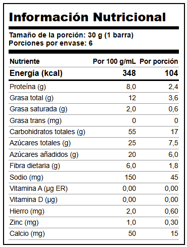
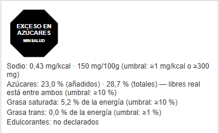

# Tabla nutricional Colombia

Genera la tabla de información nutricional en el formato legal colombiano (Res. 810 de 2021 y modificatorias), en pantalla y lista para descargar como imagen. Calcula la energía y escala a porción a partir de los valores por 100 g/mL, y arma los sellos de advertencia frontal cuando corresponden.

**Abrir la herramienta:** https://camiloarteaga.github.io/tabla-nutricional-colombia/

Todo se calcula en el navegador. Los datos que escribes no se guardan ni se envían a ningún servidor (solo quedan en el `localStorage` de tu navegador, para no perder lo escrito al recargar).

## Cómo se usa

1. **Producto.** Nombre, tamaño de la porción (texto libre para la etiqueta) y su valor en gramos o mL (para el cálculo), y porciones por envase (opcional).
2. **Valores por 100 g o 100 mL.** Los 14 nutrientes de declaración obligatoria, y la casilla de edulcorantes si el producto los contiene.
3. **Formato de tabla.** Vertical estándar, tabular o lineal (art. 30) — los tres válidos según el área de impresión disponible en el envase.
4. **Declaración.** Completa (declara siempre los 15 renglones) o según norma (omite los no significativos con su leyenda, art. 10.7).
5. **Descargar tabla (PNG)** y, si aplica, **descargar sellos (PNG)** — quedan listos para pegar en el diseño del empaque.

## Cómo calcula

- **Energía:** `carbohidratos disponibles × 4 + grasa × 9 + proteína × 4 + fibra dietaria × 2` (carbohidratos disponibles = carbohidratos totales − fibra). El factor de fibra no lo fija la norma; es la misma convención del R-45 del laboratorio.
- **Redondeo (Tabla 1, art. 9):** cifras significativas según la magnitud de cada valor — no comparte decimales entre la columna de 100 g y la de porción, cada una redondea según su propio rango.
- **Regla de cero (Tabla 2, art. 9):** un valor igual o menor al umbral de "cantidad no significativa" se declara como 0.
- **Omisión (art. 10.7, modo "según norma"):** grasa saturada, azúcares totales y fibra se omiten bajo el umbral de la Tabla 2; vitamina A, D, hierro y zinc se omiten bajo el 2 % de su valor diario de referencia (Tabla 9). Grasa trans y calcio nunca se omiten, aunque estén en cero.
- **Sellos de advertencia (Tabla 17, art. 32):** sodio por relación mg/kcal ≥ 1 o ≥ 300 mg/100 g; azúcares, grasa saturada y grasa trans como porcentaje de la energía (≥ 10 %, 10 % y 1 % respectivamente); edulcorantes, cualquier cantidad. Azúcares se calcula con **azúcares añadidos y con azúcares totales** por separado, porque la norma define "azúcares libres" como añadidos + los de jugo de fruta o verdura, dato que este formulario no pide aparte.

## Estructura

| Archivo | Contenido |
| --- | --- |
| `index.html`, `estilos.css`, `app.js` | Página e interacción |
| `calculo.js` | Energía, redondeo, omisión y sellos — módulo puro, sin DOM |
| `prueba.js` | Casos de prueba de `calculo.js` (`node prueba.js`) |
| `vendor/` | html2canvas 1.4.1 (MIT), con su licencia |

## Límites

- El tamaño de los sellos es representativo, no el cálculo exacto en cm de la Tabla 18 (que depende del área de la etiqueta, dato que este formulario no pide).
- El umbral especial de sodio para bebidas sin aporte energético (≥ 40 mg/100 mL) no se distingue: se usa siempre el umbral general de 300 mg/100 g.
- El diseño de los formatos tabular y lineal es una reconstrucción fiel al contenido de las Figuras 4 y 5 del reglamento (solo tengo su texto, no las imágenes originales), no una copia pixel a pixel.
